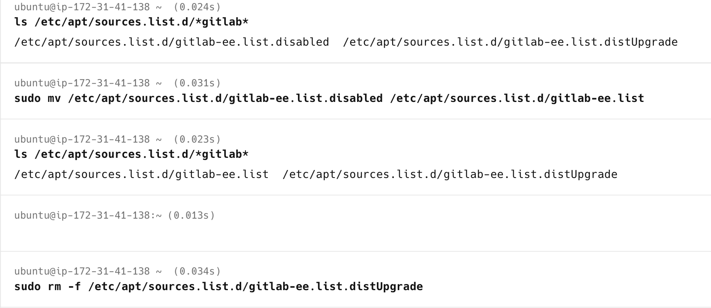

# Post OS Upgrade -- GitLab Repository Re-Enable Documentation

**Purpose:** Document the steps performed after Ubuntu OS upgrade to
restore and verify GitLab repository configuration.\
**Document Generated On:** 2026-02-18 12:14:10 UTC

------------------------------------------------------------------------

# 1. Perform OS Upgrade

## Execute Release Upgrade

``` bash
sudo do-release-upgrade
```

**Why:** Initiates the operating system upgrade to the next Ubuntu LTS
version.

------------------------------------------------------------------------

# 2. Verify OS Version After Upgrade

``` bash
lsb_release -a
```

**Why:** Confirms the system is running the expected upgraded Ubuntu
version.

------------------------------------------------------------------------

# 3. Post-Upgrade -- GitLab Repository Verification

After OS upgrade, GitLab repository was previously disabled to avoid
upgrade conflicts.\
Now it must be re-enabled and verified.

------------------------------------------------------------------------

## Step 1 -- Check Current GitLab Repository Files

``` bash
ls /etc/apt/sources.list.d/*gitlab*
```

**Why:** Verifies the current status of GitLab repository configuration
files.

Possible output example:

    gitlab-ee.list.disabled

------------------------------------------------------------------------

## Step 2 -- Re-enable GitLab Repository

``` bash
sudo mv /etc/apt/sources.list.d/gitlab-ee.list.disabled /etc/apt/sources.list.d/gitlab-ee.list
```

**Why:** Restores GitLab repository configuration so future updates can
be installed properly.

------------------------------------------------------------------------

## Step 3 -- Verify Repository Re-enabled

``` bash
ls /etc/apt/sources.list.d/*gitlab*
```

Expected output:

    gitlab-ee.list

**Why:** Confirms repository file has been successfully restored.

------------------------------------------------------------------------

## Step 4 -- Remove DistUpgrade Backup File (If Present)

During OS upgrade, Ubuntu may create a backup file like:

    gitlab-ee.list.distUpgrade

Remove it using:

``` bash
sudo rm -f /etc/apt/sources.list.d/gitlab-ee.list.distUpgrade
```

**Why:** Prevents duplicate repository entries and avoids package
conflicts.



------------------------------------------------------------------------

## Step 5 -- Verify GitLab Repository Configuration

``` bash
apt-cache policy gitlab-ee
```

**Why:** Confirms GitLab package source is correctly configured and
available from the expected repository.

------------------------------------------------------------------------

# Final Status

-   OS upgrade completed successfully
-   GitLab repository re-enabled
-   Backup repository file removed
-   Repository configuration verified

------------------------------------------------------------------------

# Recommended Final Validation

Update package index:

``` bash
sudo apt update
```

Check GitLab service status:

``` bash
sudo gitlab-ctl status
```

------------------------------------------------------------------------
