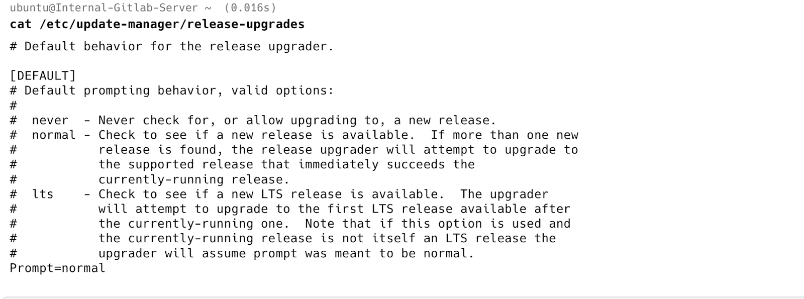
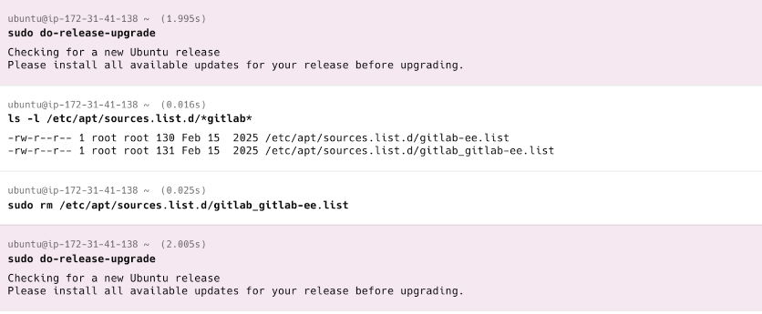
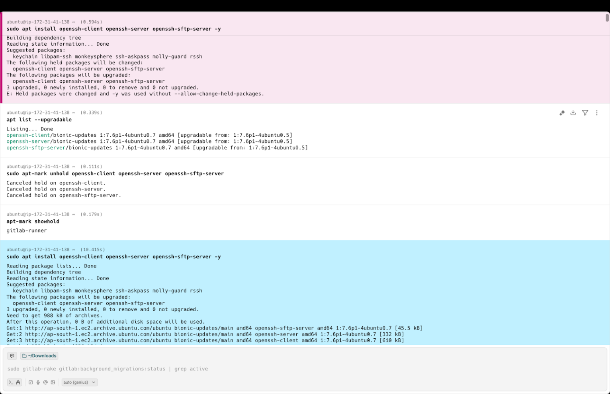

# Ubuntu OS Upgrade Documentation

**Upgrade From:** Ubuntu 18.04 LTS\
**Upgrade To:** Ubuntu 20.04 LTS\
**Server Role:** GitLab Server\
**Document Generated On:** 2026-02-16 10:29:41 UTC

------------------------------------------------------------------------

## Overview

This document explains the step-by-step commands executed during the
Ubuntu OS upgrade process from 18.04 to 20.04 on a VM running GitLab.

It also clearly highlights the **three issues encountered** during the
upgrade and how they were resolved.

------------------------------------------------------------------------

# Pre-Upgrade Steps

## 1. Update Package Index

``` bash
sudo apt update
```

**Why:** Refreshes package list to fetch latest available versions.

## 2. Upgrade Installed Packages

``` bash
sudo apt upgrade -y
```

**Why:** Installs latest updates for existing packages.

## 3. Perform Distribution Upgrade

``` bash
sudo apt dist-upgrade -y
```

**Why:** Handles dependency changes and ensures system is fully updated
before OS upgrade.

## 4. Remove Unused Packages

``` bash
sudo apt autoremove -y
```

**Why:** Cleans unnecessary packages to prevent upgrade conflicts.

## 5. Install Update Manager Core

``` bash
sudo apt install update-manager-core -y
```

**Why:** Required to enable OS release upgrade using
`do-release-upgrade`.

------------------------------------------------------------------------

# ISSUE 1 -- Release Upgrade Prompt Configuration

## Problem

System was not properly configured to upgrade specifically to the next
LTS version.

## Resolution

### Edit Release Configuration

``` bash
sudo nano /etc/update-manager/release-upgrades
```

Changed:

    Prompt=normal

To:

    Prompt=lts

**Why:** Ensures the server upgrades only to the next Long-Term Support
(LTS) version (20.04).



------------------------------------------------------------------------

# Start OS Upgrade

## Run Release Upgrade

``` bash
sudo do-release-upgrade
```

**Why:** Initiates upgrade from Ubuntu 18.04 to 20.04.

------------------------------------------------------------------------

# ISSUE 2 -- GitLab Repository Conflict

## Problem

Two GitLab repository files existed in:

    /etc/apt/sources.list.d/

GitLab requires only one repository file. Duplicate entries caused
upgrade conflict.

## Resolution

### Remove Duplicate Repository File

``` bash
sudo rm /etc/apt/sources.list.d/gitlab_gitlab-ee.list
```

**Why:** Removing duplicate repository resolved package conflict.




### Re-run Upgrade

``` bash
sudo do-release-upgrade
```

------------------------------------------------------------------------

# Post-Upgrade Cleanup

## Clean Package Cache

``` bash
sudo apt clean
```

## Refresh Package List

``` bash
sudo apt update
```

## Full Upgrade

``` bash
sudo apt full-upgrade -y
```

## Check Pending Upgrades

``` bash
apt list --upgradable
```

------------------------------------------------------------------------

# ISSUE 3 -- OpenSSH Packages Held

## Problem

OpenSSH packages were on hold and not upgrading properly.

## Resolution

### Attempt Installation

``` bash
sudo apt install openssh-client openssh-server openssh-sftp-server -y
```

### Remove Hold Status

``` bash
sudo apt-mark unhold openssh-client openssh-server openssh-sftp-server
```

### Verify Hold Removal

``` bash
apt-mark showhold
```

### Reinstall Packages

``` bash
sudo apt install openssh-client openssh-server openssh-sftp-server -y
```

**Why:** Packages were marked as held, preventing upgrade. Removing hold
resolved the issue.



------------------------------------------------------------------------

# Final Verification

## Check for Further Release Upgrade

``` bash
sudo do-release-upgrade
```

**Why:** Confirmed system was fully upgraded.

------------------------------------------------------------------------

# Additional Utility Installed

## Install Screen

``` bash
sudo apt install screen -y
```

**Why:** Allows persistent SSH session management during long
operations.

------------------------------------------------------------------------

# Final Status

-   Ubuntu successfully upgraded from 18.04 LTS to 20.04 LTS\
-   Issue 1: Release prompt configuration corrected\
-   Issue 2: GitLab repository conflict resolved\
-   Issue 3: OpenSSH held package issue resolved\
-   System fully updated and verified

------------------------------------------------------------------------

# Recommended Post-Upgrade Checks

-   Verify Ubuntu version:

``` bash
lsb_release -a
```

-   Verify GitLab services:

``` bash
sudo gitlab-ctl status
```

-   Review system logs:

``` bash
sudo journalctl -xe
```

------------------------------------------------------------------------
