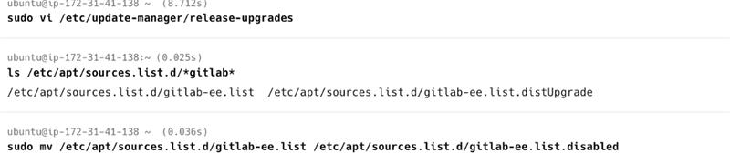

# Ubuntu OS Upgrade Documentation

**Upgrade From:** Ubuntu 20.04 LTS\
**Upgrade To:** Ubuntu 22.04 LTS\
**Server Role:** GitLab Server\
**Document Generated On:** 2026-02-18 12:03:57 UTC

------------------------------------------------------------------------

## Overview

This document explains the step-by-step commands executed during the
Ubuntu OS upgrade process from 20.04 to 22.04 on a VM running GitLab.

It also highlights the issue encountered during upgrade and the
resolution applied.

------------------------------------------------------------------------

# Pre-Upgrade Preparation

## 1. Update Package Index

``` bash
sudo apt update
```

**Why:** Refreshes package repository metadata to ensure latest package
information is available.

------------------------------------------------------------------------

## 2. Upgrade Installed Packages

``` bash
sudo apt upgrade -y
```

**Why:** Installs the latest available updates for all installed
packages.

------------------------------------------------------------------------

## 3. Perform Distribution Upgrade

``` bash
sudo apt dist-upgrade -y
```

**Why:** Handles dependency changes and upgrades packages requiring
additional dependency adjustments.

------------------------------------------------------------------------

## 4. Remove Unused Packages

``` bash
sudo apt autoremove -y
```

**Why:** Removes obsolete packages to avoid upgrade conflicts.

------------------------------------------------------------------------

## 5. Clean APT Cache

``` bash
sudo apt clean
```

**Why:** Clears cached packages to ensure no corrupted or outdated
packages interfere with upgrade.

------------------------------------------------------------------------

## 6. Install Update Manager Core

``` bash
sudo apt install update-manager-core -y
```

**Why:** Required to enable OS release upgrade using
`do-release-upgrade`.

------------------------------------------------------------------------

# Configuration Check

## 7. Edit Release Upgrade Configuration

``` bash
sudo vi /etc/update-manager/release-upgrades
```

Ensure the following line is set:

    Prompt=lts

**Why:** Ensures upgrade only to the next LTS version (22.04).

------------------------------------------------------------------------

# ISSUE -- GitLab Repository Conflict

## Problem

During upgrade preparation, GitLab repository caused conflict.

Check existing repository files:

``` bash
ls /etc/apt/sources.list.d/*gitlab*
```

## Resolution

Disable GitLab Repository Temporarily:

``` bash
sudo mv /etc/apt/sources.list.d/gitlab-ee.list /etc/apt/sources.list.d/gitlab-ee.list.disabled
```

**Why:** Disabling GitLab repository prevents third-party package
conflicts during OS upgrade.



------------------------------------------------------------------------

# Pre-Upgrade Verification

## 8. Check Held Packages

``` bash
apt-mark showhold
```

**Why:** Ensures no packages are held that could block upgrade.

------------------------------------------------------------------------

## 9. Check Upgradable Packages

``` bash
apt list --upgradable
```

**Why:** Verifies system is fully updated before performing release
upgrade.

------------------------------------------------------------------------

## 10. Install Screen Utility

``` bash
sudo apt install screen -y
```

**Why:** Ensures SSH session stability during long-running upgrade
process.

------------------------------------------------------------------------

# Perform OS Upgrade

## 11. Start Release Upgrade

``` bash
sudo do-release-upgrade
```

**Why:** Initiates upgrade from Ubuntu 20.04 LTS to 22.04 LTS.

------------------------------------------------------------------------

# Post-Upgrade Verification

## 12. Verify OS Version

``` bash
lsb_release -a
```

**Why:** Confirms system successfully upgraded to Ubuntu 22.04 LTS.

------------------------------------------------------------------------

# Final Status

-   Ubuntu successfully upgraded from 20.04 LTS to 22.04 LTS
-   GitLab repository conflict identified and resolved
-   System fully updated and verified

------------------------------------------------------------------------

# Recommended Post-Upgrade Steps

Re-enable GitLab repository if required and run:

``` bash
sudo apt update
sudo apt upgrade -y
```

Verify GitLab services:

``` bash
sudo gitlab-ctl status
```

Review system logs:

``` bash
sudo journalctl -xe
```

------------------------------------------------------------------------
